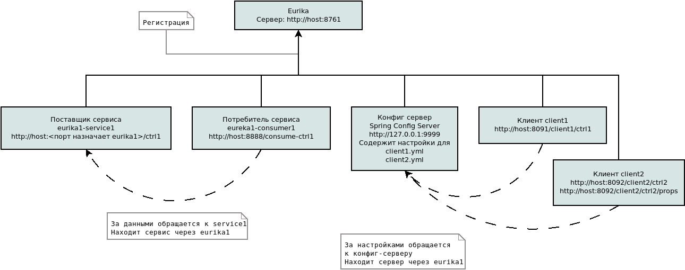

## Опыты со Spring Cloud

Описание проектов в репозитории

### eureka1 

Центральный регистратор Eureka сервисов и клиентов. Доступен по адресу
[http://127.0.0.1:8761](http://127.0.0.1:8761)

### eureka1-service

Сервис, предоставлящий данные клиентам. В сервисе rest-controller. При заапросе GET по адресу http://localhost:????/ctrl1 выдается текущее время
Запись ниже означает что копии сервисов будут доступны для клиентов на любом свободном порту.
````
server:
    port: 0
````

Конф-ию порта будет определять и предоставлять клиентам регистратор **eureka1**

### eureka1-consumer

Клиент. Выполнен в виде контроллера. 
При GET запросе [http://127.0.0.1:8888/consume-ctrl1](http://127.0.0.1:8888/consume-ctrl1) находит через **eureka1** сервис **eureka1-service** и выводит полученную инфу. Название **eureka1-service** задано в application.yml.

````
service-ctrl1: http://eureka1-service-ctrl1/ctrl1
````

### config-server1

Проект config-server

Проверка работы:
````shell script
curl http://127.0.0.1:9999/application/default/master
````

Должно выдать что-то типа такого:
```json
{
  "name": "application",
    "profiles": [
      "default"
    ],
  "label": null,
  "version": "6ca53001bb418f575076d74e89aa59262a90d121",
  "state": null,
  "propertySources": []
}  
```

### config-server1-client

Первый клиент для конфиг-сервера *config-server1*

Для проверки использовать 
```shell script
http :8091/ctrl1
``` 

### config-server1-client2

Второй клиент для конфиг-сервера *config-server1*.
Проверяются раздельные конфигурации для разных приложений. Имя приложения задается параметром
```
spring:
  application:
    name: client2
```

Для проверки использовать 
````shell script
http :8092/ctrl2
```` 

>Для проверки работы обоих клиентов используется [Проект с конфигурациями](https://github.com/cherepakhin/config-repo)

### Соединил все вместе



### feign-client

Feign сервис для маршрутизации к сервису eureka1-service. Сконфигурирован на порту 8093. Данные с eureka1-service доступны по запросу:
```shell script
http :8093/feign1/ctrl
```
